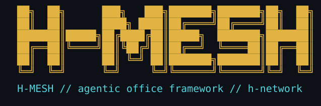

<p align="center">
  

  [](LICENSE)
  
  
  
  
</p>

# h-mesh

An agentic CLI framework where agents address each other directly, by name, and a single switch forwards every message to its destination. Work is tracked on a shared board per agent: pull a ticket, work it, mark it done.

Each agent is a real, stateful terminal session -- not a one-shot API call. It runs its own CLI (Claude, Codex, or Gemini/agy) in a live TUI, with conversation history that persists and resumes across restarts. One deliberate exception: a `claude_sdk`-type agent is the reverse of this by design -- a stateless one-off SDK call per message, with optional context-addressed memory layered on top instead of a persistent pane (see [One-off SDK agents and memory](#one-off-sdk-agents-and-memory) below).

The design borrows its layering from networking, not just its name -- a bus layer that only knows envelopes and queues, a switch layer that forwards by address without reading payloads, and an edge layer where each agent's actual delivery -- a terminal, a mailbox, or another destination-specific target -- lives. Same separation of concerns Ethernet uses between physical transport, switching, and the endpoint.

Every endpoint is a module, and every module owns its own port -- the piece that assembles an outgoing envelope and disassembles an incoming one into that endpoint's specific action.

A Telegram interface is included, talking to the framework over the same REST API any external client would use -- a separate module, not a special case.

Every hop a message takes is logged, the same way a real packet's path can be traced -- nothing moves silently.

## Quick install

On a fresh host, one command clones h-mesh and hands off straight to
`setup.sh`:

```bash
curl -fsSL https://raw.githubusercontent.com/h-network/h-mesh/main/install.sh | sh
```

It clones into `~/.local/share/h-mesh` by default (`H_MESH_INSTALL_DIR` to
choose another location), or updates an existing checkout there if one
already exists. That's a hidden, machine-managed location on purpose --
`~/h-mesh` itself is reserved for agent working directories (see
`setup.sh`'s wizard), not the source checkout. Extra arguments pass straight through to `setup.sh` -- e.g. to skip
the wizard:

```bash
curl -fsSL https://raw.githubusercontent.com/h-network/h-mesh/main/install.sh \
  | sh -s -- --pod mypod --tenant mytenant --non-interactive
```

This is a companion to cloning it yourself, not a replacement -- see below
for the manual clone-then-`setup.sh` path, and [Host installation](#host-installation)
for installing just the Python package without any of the bootstrap steps.

## Bootstrap script

Cloning it yourself first works exactly the same way, if you'd rather skip
the one-liner above:

```bash
git clone https://github.com/h-network/h-mesh.git
cd h-mesh
./setup.sh
```

`./setup.sh` bootstraps a fresh host or pod (already have a checkout? this
is what `install.sh` above hands off to). Run at a real terminal with no
flags, it's an interactive wizard: pod/tenant name, how many agents and
their names (`architect` is agent #1 by default), which CLI each runs
(claude/codex/agy), account setup if more than one credential is needed,
optional local model provider config (endpoint URL and model id, verified
with a real probe against the endpoint before it's accepted), and optional
Telegram bot config (bot token, chat ID, spoken voice replies). Re-running
it never silently wipes a prior answer -- blank at a prompt keeps whatever's
already there.

Piped, scripted, or passed `--non-interactive`, it never prompts -- flags,
environment, and whatever's already been configured for that tenant are all
it uses. Per-agent exceptions (`AGENT_CLIS`, `AGENT_PROFILES`,
`AGENT_PROVIDERS`) are each set as a comma-separated list of `agent=value`
pairs, e.g. `AGENT_CLIS=worker1=codex,worker2=agy` -- exactly one `=` per
pair, agent name on the left. A malformed entry (wrong separator, a missing
value) is a hard error, not a silently-ignored one: this matters most for
`AGENT_PROVIDERS`, since an agent with no override that setup.sh recognizes
runs against the real vendor API, not the local provider you configured for
it -- a typo there is real spend, not just a wrong setting. Either way it
also:

- verifies/auto-installs system dependencies (`redis-server`, `python3-venv`,
  and `h-agent` itself via its own installer) -- skip with `--skip-deps`
- installs h-mesh into a venv and persists that venv's `bin` dir on `PATH`
  (via `~/.bashrc` and `~/.profile`, so it's on `PATH` for every future
  shell/pane, not just the one running setup.sh)
- installs h-mesh's default `~/.tmux.conf` (mouse mode, status bar, pane
  borders -- the same UX the container base image otherwise bakes in, for a
  bare host that has none; never overwrites an existing `~/.tmux.conf`)
- installs a context-usage statusline (a progress bar showing how full the
  model's context window is) for the default account's claude config;
  profiled accounts get it too, at hire time, since that account's config
  dir doesn't exist until then. codex/agy agents are untouched -- they have
  their own statusline mechanisms, or none
- seeds the registry's fixed lifecycle participants (`host` -> office,
  `api` -> api) for the given pod/tenant
- starts the `h-mesh-switch`, `h-mesh-tmux-reconciler` and `h-mesh-watchdog`
  daemons (always-on -- watchdog needs no credentials, and every
  multi-agent office wants presence sampling and stall/silence alerting
  from the first hire on), and -- only if a Telegram bot was configured --
  the REST API, Telegram bot, and session daemons too (the bot needs the
  API to talk to and session to back its `/watch` command; there's no
  separate "enable the API" question, a configured bot enables all three).
  All duplicate-safe: a re-run against an already-running install restarts
  nothing that's already up, and a daemon disabled since a previous run
  gets stopped, not orphaned
- hires every agent from the wizard's roster that isn't already running

```bash
./setup.sh                          # interactive wizard, at a terminal
./setup.sh --pod mypod --tenant mytenant --non-interactive   # scripted, no prompts
```

Run `./setup.sh --help` for the full set of flags (Redis URL, tmux session
name and socket, an existing venv, `--skip-install`, `--skip-deps`,
`--no-daemons`, `--non-interactive`, etc.). Daemon logs and PID files are
written under `$H_MESH_RUN_DIR` (default `~/.h-mesh/run/<tenant>`).

A host that never used the wizard (flags only, no roster ever configured)
keeps today's manual-hire behavior:

```bash
export AGENT_NAME=host POD=mypod TENANT=mytenant
h-mesh-office hire <agent-name>
```

Hiring starts a fresh CLI session by default, even when that agent name has
local session history. Pass `--resume` to opt into restoring prior history.

## Container

`container/Dockerfile` and `container/compose.yaml` are the supported way to
run h-mesh entirely in Docker -- one container per office (pod/tenant),
nothing assumed to exist outside the image. The container's `entrypoint.sh`
starts Redis (loopback-only, AOF-persisted under a state volume) and then
calls this same `setup.sh --non-interactive` -- the roster, hire, and
daemon-start steps are exactly the ones described above, not a separate
implementation.

```bash
./setup.sh --container                          # interactive wizard, at a terminal
./setup.sh --container --non-interactive         # scripted, flags/env only (or H_MESH_INSTALL_MODE=container ./setup.sh)
```

At a real terminal with no `--host`/`--container` flag, `./setup.sh` asks
which you want before anything else -- see "Bootstrap script" above. Either
form hands off entirely to `container/bootstrap.sh`, a smaller wizard (same
banner as the host wizard) that collects `POD`/`TENANT`/`AGENTS`/
`DEFAULT_CLI`, the default account's OAuth token (blank to log in
interactively later -- see "Finding and attaching..." below for how a
container operator can actually do that), and optional Telegram bot config,
writes them to `offices/<pod>/<tenant>/.env`, and runs `docker compose up
--build`. Enabling Telegram here also forces the TLS-or-plaintext decision
described below on the spot -- it can no longer ship silently unresolved
the way it originally could, which produced a container that refused to
start with no interactive warning beforehand. Run `./container/bootstrap.sh
--help` for its full flag/env surface.

**One office, one directory, one explicit Compose project.** Docker
Compose's own project-name default is the *containing folder's* name
(`container`), identical for every checkout of this repo regardless of
pod/tenant -- two offices sharing a host, or even two checkouts of the same
repo, collide on that default, and one `docker compose up` silently
recreates the other's live office (measured, not theorized). `bootstrap.sh`
always resolves an office to `offices/<pod>/<tenant>/.env` and always passes
`docker compose -p h-mesh-<pod>-<tenant>` explicitly, so multiple offices
are isolated by construction. `offices/` is gitignored -- it holds live
credentials (`CLAUDE_OAUTH_TOKEN_<PROFILE>`, `API_TOKEN`, etc.), the same as
`container/.env` (kept as a single-office convenience default) always was.
Two offices whose `API_PORT`/`SESSION_PORT` doors are both enabled and both
default to `8080`/`8081` still need distinct host ports set explicitly --
Compose project isolation doesn't free up an OS-level port collision.

**Finding and attaching a running office's tmux session.** `./container/
bootstrap.sh --pod POD --tenant TENANT --attach` (defaults match the rest of
this script: `default`/`default`) attaches you directly, in one step --
resolves the same office identity `bootstrap.sh` always does, then runs
`docker compose exec` into the container and `tmux attach`s there. Every
`up`/`--attach` run also prints the exact one-liner for the office it just
resolved (including the equivalent plain `docker compose ... exec ... tmux
attach ...` form, if you'd rather not depend on this script). The tmux
session name is always the tenant name (`$TENANT`), inside the container's
own `$HOME/.h-mesh/tmux` socket directory -- not the host's tmux, and not
guessable from a bare `tmux attach` run outside the container.

Every non-interactive env var from "Bootstrap script" above (`AGENTS`,
`DEFAULT_CLI`, `ACCOUNTS`, `AGENT_CLIS`/`AGENT_PROFILES`/`AGENT_PROVIDERS`,
`CLAUDE_OAUTH_TOKEN_<PROFILE>`, `PROVIDER_LOCAL_*`, `TELEGRAM_*`,
`API_TOKEN`) applies unchanged. `bootstrap.sh`'s interactive wizard prompts
for the *default* account's `CLAUDE_OAUTH_TOKEN_DEFAULT` and for
`TELEGRAM_*` directly, mirroring the host wizard -- these were previously,
incorrectly, treated as file-only "advanced" options; a working office
always needs some credential, and the choice to enable Telegram is one the
host wizard already offered. Per-agent exceptions
(`AGENT_CLIS`/`AGENT_PROFILES`/`AGENT_PROVIDERS`), a second-or-later
account, and local model provider config (`PROVIDER_LOCAL_*`) remain
file-only -- this script has no per-agent or multi-account UI at all,
uniform-single-account is its whole model, so those genuinely don't apply
to it. `API_TOKEN` is never prompted anywhere, even on a bare host --
always generated. `API_PORT`/`SESSION_PORT` choose the **host** side of the
port mapping only; the api and session doors always bind
`0.0.0.0:8080`/`0.0.0.0:8081` inside the container (see the Dockerfile's
own comment on why), so publishing them is compose's decision, not the
process's.

As on a bare host, the api/session/Telegram-bot daemons only start once
`TELEGRAM_BOT_TOKEN` and `TELEGRAM_CHAT_ID` are both set -- but because
those doors bind `0.0.0.0` inside the container unconditionally, enabling
them also requires either `API_TLS_CERT`/`API_TLS_KEY` or an explicit
`H_MESH_ALLOW_PLAINTEXT=1` (see `container/.env.example`'s own comment on
the tradeoff); the entrypoint refuses to start at all with a single clear
message if neither is set, rather than crash-looping the container with the
real reason buried in a per-daemon log. This same `API_TLS_CERT`/
`H_MESH_ALLOW_PLAINTEXT` check is app-level (`modules/api/server.py`,
`modules/session/app.py`), not container-specific -- it applies to a bare
host too whenever `API_BIND`/`SESSION_BIND` isn't loopback, though that's
rare on a host since those default to loopback there. `setup.sh`'s own host
wizard has no interactive handling of this either; `bootstrap.sh`'s wizard
is the first place in this project that actually prompts for it, forcing
the decision the moment Telegram is enabled rather than leaving it to
surface as a crash-loop afterward: a real cert path (for an operator who
has already arranged to get one into the container themselves -- there is
no built-in delivery mechanism for a *generated* one yet) or explicit,
warned plaintext.

Three named volumes per office carry state that must survive a container
recreate: Redis's AOF file, the persisted tenant config, and daemon
logs/pidfiles (`$HOME/.h-mesh`); and claude's and codex's own local state,
notably `--continue`/`--resume` session history (`$HOME/.claude`,
`$HOME/.codex`) -- without the latter two, that history lived only in the
old container's writable layer and was gone the moment `up` replaced it.
`docker compose down` keeps all three, `down -v` drops them. `docker compose
logs -f` shows the same daemon logs `$H_MESH_RUN_DIR` would on a bare host,
tailed by the entrypoint. `h-agent`, its CLIs, and h-mesh's own package are
all installed at image build time (`h-agent`'s own installer, the same one
setup.sh's dependency step would otherwise run on a bare VM missing it, plus
`jq` so it can actually apply its own onboarding defaults -- without it,
every agent's first launch hits claude's full interactive first-run tour
instead of a working prompt) so a running container never needs outbound
network just to boot.

`clients/web` (the browser console) is not part of this image -- it has its
own separate container path; see `clients/web/README.md`.

## One-off SDK agents and memory

Not every agent needs a persistent terminal session. A `claude_sdk`-type
agent (see `modules/claude_sdk/README.md`) runs one Claude Agent SDK
`query()` call per message instead of hosting a live CLI pane -- no
`ClaudeSDKClient`, no persistent session, the opener sends the reply itself.
There's no `office hire` path for one yet; it's registered directly in the
tenant registry.

A `Message` payload's `context` field names a hot-tier, TTL-evicted
conversation (`lib/chat_memory.py`) -- the same `context` on a later
message recalls that conversation's recent turns; omitting `context`
entirely is a genuine one-off, no memory read or write at all:

```bash
h-mesh-office send -a AGENT --context bgp-65001 "..."   # threads into that context
h-mesh-office send -a AGENT "..."                        # genuine one-off, no memory touched
h-mesh-office contexts -a AGENT                          # list AGENT's live contexts
```

The same discovery is reachable externally at `GET /agents/{agent}/contexts`
(see `modules/api/README.md`). Long-term/semantic memory -- what, if
anything, happens once a context's TTL elapses -- is deliberately out of
scope today; see `lib/chat_memory.py`'s own module docstring.

A `Message` payload's `live_to` additionally fans every hop of that same
`query()` call out live as a `Progress` envelope, typically to a
`webui`-registered agent (see `modules/webui/README.md`) -- one more
registry-only port_type, also with no `office hire` path yet. Its served page
(`GET /agents/{agent}/live`, once Telegram/the api service are configured) is
the actual browser view of a `claude_sdk` agent's progress in real time;
`GET /agents/{agent}/live/events`/`live/stream` are the same data as JSON
poll/SSE for any other client. See `modules/claude_sdk/README.md` for the
exact `live_to`/`live_cc_source` payload shape.

## Upgrading and restarting daemons

`h-mesh-upgrade` (`services.upgrade`) updates an existing install in place --
`git pull --ff-only`, reinstall, then cleanly restart the same daemons
setup.sh started (stop via SIGTERM/SIGKILL fallback, then start fresh with
the current environment). It won't double-start daemons against an
already-running install: it always stops first.

```bash
h-mesh-upgrade --pod mypod --tenant mytenant
```

Same pod/tenant/redis-url/session/tmux-tmpdir/tmux-socket/venv flags as
setup.sh, plus `--skip-install` and `--skip-pull` (`h-mesh-upgrade --help`
for the full list). Pod and tenant must be valid non-empty h-mesh names; an
invalid value is rejected before the upgrade stops or starts anything. It
also re-persists the venv bin dir on `PATH`,
re-installs the default `tmux.conf`, and re-installs the default account's
statusline, so running it repairs an install that predates any of those
fixes.

⚠ **Known limit:** a hired agent's tmux pane inherits its environment once,
at creation. Upgrading restarts h-mesh's own daemons and reinstalls the code
they run, but it cannot reach into an already-hired agent's live pane and
refresh its env -- that agent keeps whatever it started with until it's
re-hired or its window is otherwise recreated. This is deliberate: forcing
that refresh would mean killing live agent sessions on every upgrade.

`h-mesh-start` (`services.daemons`) starts the same daemons without pulling
or reinstalling -- useful after a crash, or on a host where they aren't
running yet. It's also duplicate-safe: a daemon it finds already alive (via
its authenticated pidfile) is left running rather than started a second time.
Pidfiles are paired with the Linux process start time, and daemon management
opens a Linux pidfd before authentication then signals through that same process
handle, so a reused numeric PID cannot redirect a signal to an unrelated
process. If ownership cannot be
proved, daemon management fails closed and reports the condition without
signalling; a stale PID that demonstrably belongs to another process is treated
as the normal “daemon not running” state. A start is
atomic with respect to processes that invocation creates: they are reported
as started only after surviving the startup health window, and if any one
fails, all newly created siblings are stopped. Processes found running before
the invocation are never part of that rollback.

```bash
h-mesh-start --pod mypod --tenant mytenant
```

## Host installation

h-mesh is installed from the repository root. An editable install is useful for
development; a regular install uses the same package metadata for production:

```bash
python -m venv .venv
.venv/bin/python -m pip install -e .
```

Contributors running the test suite should install the test extra with
`.venv/bin/python -m pip install -e '.[test]'`.

After activating the project virtual environment, run the complete suite with
the canonical runner. The runner resolves the repository root itself, so the
command works from any working directory:

```bash
python -m tools.run_tests
```

The configured test path covers the entire `h-app` source tree, including
tests colocated under `clients/web`. The runner asserts a minimum collection
count before executing pytest, so under-collection fails loudly while normal
test additions require no maintenance. If tests are intentionally removed,
update `EXPECTED_MINIMUM_TEST_COUNT` in the runner.
Passing an explicit path such as `pytest tests/` overrides configured discovery
and intentionally runs only the selected subtree; do not use a narrowed path
as evidence that the complete suite passes.

Use an isolated environment when developing or validating an install. In
particular, do not install h-mesh into an environment that provides another
application's live commands; keeping prefixes separate prevents either
application from replacing the other's executables.

The install makes the top-level `core`, `lib`, `modules`, and `services`
packages importable independently of the current working directory. It also
provides these process entry points:

- `h-mesh-switch` — the core switch daemon
- `h-mesh-api` — the REST API daemon
- `h-mesh-openshell-port AGENT` — direct OpenShell delivery-port invocation
- `h-mesh-session` — the tmux control-mode session daemon
- `h-mesh-tmux-reconciler` — the tmux registry reconciler daemon
- `h-mesh-watchdog` — the delivery and presence watchdog daemon
- `h-mesh-tmux-port AGENT` — direct tmux delivery-port invocation
- `h-mesh-office` — the operator CLI
- `h-mesh-clone-to-all` — the standalone clone-to-all compatibility command
- `h-mesh-upgrade` — pull, reinstall, and cleanly restart the daemons setup.sh started
- `h-mesh-start` — start those same daemons if not already running, without pulling or reinstalling

The `h-mesh-` prefix is intentional: h-mesh can share an installation prefix
with another application without replacing its live `office` executable.

Each process reads its deployment configuration from environment variables;
the module READMEs document the required variables and external services.

## License

PolyForm Noncommercial 1.0.0 -- see [`LICENSE`](LICENSE). Third-party
dependency licenses are credited in [`NOTICE`](NOTICE). "h-mesh" and
"h-network" naming/branding are covered by [`TRADEMARKS.md`](TRADEMARKS.md).
